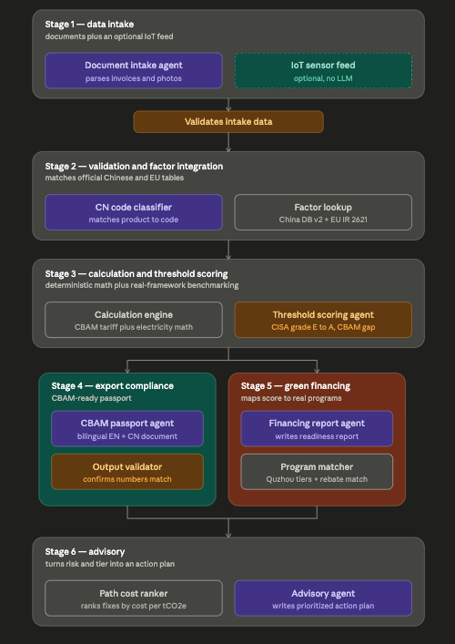

# PRD: 钢铁下游SME碳护照与绿色金融平台
**Codename:** Carbon Passport for Steel SMEs
**Prepared for:** coding agent build (Claude Code), one-month hackathon MVP
**Status:** ready to build

---

## 1. Problem statement

Chinese steel-downstream SMEs (bolt/fastener/structural-steel manufacturers, CN codes under HS 7207/7208/7301/7302/7318/7326) face a compounding squeeze:

1. **EU CBAM** enters its definitive, financially binding phase from 1 January 2026. Without verified emissions data, these SMEs are hit with punitive default values — real industry reporting puts China-origin defaults at roughly double actual measured emissions, and full-rate CBAM cost on a hex bolt (CN 7318 15 88) reaches an estimated €313/tonne by 2034.
2. **No internal expertise.** Per our research, carbon/CN-code literacy work is done ad hoc by QC or EHS staff with no dedicated carbon specialist — a documented "talent desert" (专业碳管理人才荒漠).
3. **Domestic policy pressure.** China's 碳排放总量和强度双控 regime (fully active from 2026) and anchor-enterprise ESG pass-through (e.g. BMW requiring 300+ Tier-1 China suppliers to sign renewable-PPA commitments) mean SMEs face elimination from supply chains even domestically if they can't produce credible carbon data.
4. **No path from number to action.** Existing carbon calculators stop at "here's a number." SMEs need to know whether that number passes a real threshold, and what the cheapest fix is if it doesn't.

**This product turns invisible emissions into three concrete, usable outputs**: a CBAM-ready export passport, a green financing readiness report mapped to real Chinese subsidy/credit programs, and a prioritized action plan — distributed through Baowu/Ansteel as a value-added service to their own downstream customers, which simultaneously improves Baowu's own Category 10 ("processing of sold products") Scope 3 data quality.

---

## 2. Goals and non-goals

### Goals (MVP, one month)
- Support exactly 8 CN codes (see §6.1), all steel/steel-product, Chapters 72/73
- Produce a bilingual (EN + CN) CBAM export passport with a defensible, cited tariff-exposure estimate
- Produce a Chinese-only green financing readiness report mapped to real programs
- Score every submission against two real frameworks: EU CBAM benchmark (route-specific) and CISA's low-carbon steel grade (E–A)
- Produce a ranked, cost-aware action plan (not just a subsidy list)
- Keep every regulated number traceable to a cited source — no LLM-generated arithmetic anywhere in the trust path

### Non-goals (explicitly out of scope for this build)
- Zero-knowledge proofs / cryptographic privacy layer
- Blockchain or distributed ledger of any kind
- Full IoT hardware rollout at scale — one bench-demo sensor prop only, decoupled from the critical path
- Coverage of aluminum, cement, fertilizer, hydrogen, or electricity CBAM sectors
- Autonomous/self-planning agent frameworks — this is a fixed pipeline, not an agent that decides its own steps
- Legal or tax advice — every output carries a disclaimer

---

## 3. Users

| User | What they need | Where they touch the system |
|---|---|---|
| SME operator (QC/EHS staff, no carbon background) | Upload data, get a passport + report + plan, understand it without training | Web app, document intake |
| EU importer / customs contact | Supporting evidence for their own CBAM declaration | Reads the passport PDF (given to them by the SME) |
| Chinese bank / subsidy administrator | Evidence to approve preferential credit or a subsidy | Reads the financing report PDF |
| Baowu/Ansteel account manager (stretch) | Aggregate view of which downstream customers are compliant, at what tier | Separate aggregate dashboard — sees only tier + verified totals, never raw invoice data |

---

## 4. Tech stack — and why

| Layer | Choice | Rationale |
|---|---|---|
| Frontend | Next.js 14 (App Router) + TypeScript + Tailwind + shadcn/ui | Fastest path to a professional-looking form + document preview UI within a month; shadcn gives accessible, pre-built components so the frontend person isn't hand-rolling forms |
| Backend | Python 3.11 + FastAPI | The calculation engine, factor lookups, and PDF rendering all benefit from Python's data-handling libraries; FastAPI gives typed request/response schemas for free, which matters because every agent boundary here needs a strict schema |
| LLM | Qwen models via Alibaba Cloud Model Studio (DashScope), OpenAI-compatible endpoint — full tier-to-task mapping in §4.1 | Splits cost/latency the same way as any tiered-model plan: a fast vision model for extraction, a fast text model for narrow classification, a stronger model for prose quality on the two report-writing agents and the advisory agent. Using the **Beijing region endpoint** keeps SME production data on domestic infrastructure, which resolves the cross-border data export concern noted in §10 — pin the region explicitly in config, don't leave it on the international/Singapore default. DashScope's OpenAI-compatible mode supports standard function calling, so the same forced-JSON-output pattern used throughout §8 works unchanged; only the client base_url, API key, and model name strings change from an Anthropic-style integration |
| Local NLP pre-processing | ModelScope (魔搭) open models, self-hosted in the backend — see §4.2 | Deterministic, zero-per-token-cost pre-processing in front of the LLM calls: OCR text layer for scanned invoices, document-type pre-screening that rejects irrelevant uploads before any paid API call. Confined strictly to pre-processing — never in the trust path for regulated numbers, never writing prose |
| Database + Auth + File storage | Supabase (managed Postgres + Storage + Auth) | One provider covers three infra needs with near-zero setup time — critical for a one-month build with no dedicated DevOps person |
| Document generation | WeasyPrint (Python, HTML/CSS → PDF) | Needs to render CJK characters cleanly for the bilingual passport and Chinese-only report; HTML/CSS templating is faster to iterate on than a binary PDF library, and the whole team can edit templates without touching Python logic |
| Optional IoT ingestion | ESP32 + EmonLib firmware → MQTT → lightweight Python subscriber writing into Supabase | Matches the original hardware concept; kept fully decoupled — if this component fails, nothing else in the system notices |
| Hosting | Vercel (frontend), Render (backend + MQTT subscriber worker), Supabase (managed) | All three have zero-config deploys from GitHub, which matters more than raw performance for a one-month build |
| Version control | GitHub, single monorepo (`/frontend`, `/backend`, `/firmware`, `/docs`) | Keeps the coding agent's context in one place |

**Explicitly rejected:** blockchain/ledger infra, ZK-proof libraries, any multi-agent orchestration framework (LangGraph/AutoGen/CrewAI) — the pipeline is a fixed, code-orchestrated sequence of API calls, not an autonomous agent system. Orchestration is plain Python function calls in FastAPI route handlers, nothing more.

### 4.1 Qwen model tiering (Alibaba Cloud Model Studio / DashScope, Beijing region)

The pipeline has multiple agents but very different task difficulty per agent, so each task is pinned to the cheapest Qwen tier that can do it reliably. The rule: **narrow, schema-forced tasks get a Flash-tier model; customer-facing prose gets Plus; nothing in this product needs Max.**

| Agent / task | Model (stable alias) | Tier | Why this tier is enough |
|---|---|---|---|
| Document intake (§8.1) | `qwen3-vl-flash` | Low (vision) | Field extraction from an invoice photo into a forced JSON schema — no reasoning or prose quality required |
| CN code classifier (§8.3), first pass | `qwen-flash` | Low (text) | 8-way closed classification with the reference table in-prompt; temperature 0 |
| CN code classifier, escalation pass | `qwen-plus` | Mid | Runs **once, only if** the Flash pass returns confidence below threshold or `out_of_scope`; if Plus also comes back low-confidence, route to manual confirmation — never a third call |
| CBAM passport agent (§8.6) | `qwen-plus` | Mid | Bilingual EN/CN prose read by an EU customs contact — quality matters |
| Financing report agent (§8.8) | `qwen-plus` | Mid | Chinese prose read by a bank — quality matters |
| Advisory agent (§8.10) | `qwen-plus` | Mid | Plain-language plan; needs to reason about trade-offs the ranker surfaced |
| — (no task assigned) | `qwen-max` | High | Deliberately unused: no task here requires frontier reasoning, and Max input/output pricing is ~4–8x Plus. If a writing agent underperforms in week-1 review, upgrade that one agent only — do not default the whole pipeline up a tier |

Token-cost rules that go with the tiering:

- **Escalation, not duplication.** The only model-escalation path in the system is the classifier's single Flash→Plus retry. Writing agents never escalate; a failed output-validator check regenerates **only the failing section** with the same model (§8.7), not the whole document with a bigger one.
- **Disable thinking mode** (`enable_thinking: false` / non-thinking variants) on every call. Every task here is either schema extraction or templated prose; paying for reasoning tokens buys nothing.
- **Pin dated snapshots in config** (e.g. `qwen-plus-2025-12-01` style names), not just stable aliases, once week-1 output review passes — silent alias upgrades mid-hackathon can change output formatting and break the regex-based output validator.
- **Keep the 8-code reference table, disclaimer text, and document skeletons in the static prefix of each prompt** so DashScope context caching discounts the repeated tokens across submissions.
- **Beijing region endpoint, pinned in config** — restated from §10 because it is load-bearing: this is what keeps SME production data on domestic infrastructure.

### 4.2 ModelScope (魔搭) local models — pre-processing only

ModelScope is used for **free, self-hosted, deterministic-ish pre-processing in front of the paid Qwen calls** — it is China's model hub (Alibaba-backed, models downloadable and runnable locally via the `modelscope` Python library), so it fits the same data-sovereignty story as the Beijing DashScope endpoint. Hard boundary: ModelScope models may gate, cheapen, or enrich the *input* to Stage 1 — they may never produce a number that reaches the calculation engine, never write user-facing prose, and the pipeline must run correctly with Stage 0 entirely disabled (it is an optimization, not a dependency).

Adopted (Stage 0, both optional and feature-flagged):

| Model (ModelScope ID) | Task | Where it saves tokens / catches an edge case |
|---|---|---|
| DAMO 读光 OCR — detection `iic/cv_resnet18_ocr-detection-line-level_damo` + recognition `iic/cv_convnextTiny_ocr-recognition-general_damo` | OCR text layer for scanned/photographed invoices | Extracted text is passed *alongside* the image to Qwen3-VL-Flash, improving field-extraction reliability on low-quality photos (the realistic SME upload). Also lets born-digital PDFs skip the vision call entirely when the text layer alone fills the intake schema |
| StructBERT zero-shot classifier `damo/nlp_structbert_zero-shot-classification_chinese-base` | Document-type pre-screen: is this upload plausibly an invoice / utility bill / production record? | Rejects selfies, blank pages, and wrong documents **before any paid API call**, with an immediate "please upload X instead" message — cheaper and faster than letting Qwen3-VL-Flash discover the problem |

Evaluated and **not** adopted (recorded so nobody re-proposes them):

- **RaNER NER models** (`damo/nlp_raner_named-entity-recognition_chinese-base-news`) — entity extraction duplicates what Qwen3-VL-Flash already does inside the forced intake schema; running both creates two extraction sources to reconcile, which is a new failure mode, not a saving.
- **CSANMT translation models** (`damo/nlp_csanmt_translation_en2zh` / `zh2en`) — the passport's bilingual output is generated natively by Qwen-Plus in one pass; a separate MT hop adds a consistency risk between the EN and CN halves of a regulated document.
- **Local Qwen open weights served from ModelScope** — self-hosting an LLM adds GPU ops burden with no benefit over the Beijing DashScope endpoint for a one-month MVP; revisit only if per-token cost becomes a real problem at scale.

---

## 5. System architecture



Six-stage pipeline plus an optional Stage-0 pre-screen, code-orchestrated (no agent decides its own next step):

```
Stage 0 — Pre-screen (optional, local ModelScope models, no API cost — see §4.2)
  ├─ Document-type pre-screen (StructBERT zero-shot) — rejects irrelevant uploads before any paid call
  └─ OCR text layer (DAMO OCR) — extracted text passed alongside the image to Stage 1

Stage 1 — Data intake
  ├─ Document intake agent (Qwen3-VL-Flash, vision) — parses invoice/photo/PDF uploads
  ├─ CSV/XLSX parser (deterministic code, no LLM) — structured files never go through the vision model
  └─ IoT sensor feed (optional, no LLM) — ESP32/EmonLib kWh readings, decoupled

Stage 1→2 gate: Intake validator (code, not LLM) — plausibility checks

Stage 2 — Validation and factor integration
  ├─ CN code classifier agent (Qwen-Flash, escalates once to Qwen-Plus on low confidence) — matches product to 1 of 8 supported codes or returns out_of_scope
  └─ Factor lookup (deterministic code) — China GHG factor DB v2 + EU IR 2025/2621

Stage 3 — Calculation and threshold scoring
  ├─ Calculation engine (deterministic Python, no LLM) — CBAM tariff + electricity intensity
  └─ Threshold scoring agent (rule-based, not generative) — CISA grade E–A, CBAM benchmark gap, de minimis check

Stage 3 output forks in parallel:

Stage 4 — Export compliance                    Stage 5 — Green financing
  ├─ CBAM passport agent (Qwen-Plus)              ├─ Financing report agent (Qwen-Plus)
  └─ Output validator (code) — number match       └─ Program matcher (deterministic lookup)

Both converge into:

Stage 6 — Advisory
  ├─ Path cost ranker (deterministic) — cost per tCO2e closed, Path 1/2/3 framework
  └─ Advisory agent (Qwen-Plus) — writes prioritized action plan
```

**The non-negotiable design rule for the coding agent:** anything colored "deterministic" in the design above must never call an LLM. Anything that calls an LLM must never perform the final arithmetic on a regulated number — it may only read a number that deterministic code already computed and write prose around it. If an implementation detail forces this rule to be broken, stop and flag it rather than proceeding.

---

## 6. Data specification

### 6.1 Supported CN codes (MVP scope — do not expand without explicit sign-off)

| CN code | Description | Route(s) applicable |
|---|---|---|
| 7207 | Semi-finished steel billets | BF-BOF, DRI-EAF |
| 7208 10 00 | Hot-rolled coil (HRC) | BF-BOF |
| 7213 / 7214 | Hot-rolled bars / wire rod | BF-BOF, scrap-EAF |
| 7301 | Sheet piling, welded angles | downstream (any route) |
| 7302 | Railway track construction material | downstream (any route) |
| 7318 15 42 / 7318 15 88 | Bolts, screws | downstream (any route) |
| 7326 | Other steel articles / hardware | downstream (any route) |

Excluded explicitly: CN 7204 (ferrous scrap — not CBAM-applicable), any non-steel HS chapter.

### 6.2 Reference data sources (must be loaded before any calculation runs)

| Source | Used for | Status |
|---|---|---|
| China National GHG Emission Factor Database v2 (data.ncsc.org.cn/factories) | Default crude-steel carbon intensity by route when SME has no measured data | Real, public. **TODO before launch:** pull exact DRI-EAF and scrap-EAF values — only BF-BOF (3.506 tCO2e/t) is confirmed in this PRD |
| Commission Implementing Regulation (EU) 2025/2621 | EU free-allocation benchmarks (BF-BOF 1.370, DRI-EAF 0.481, scrap-EAF 0.072 tCO2e/t) and phase-in markup (10%/20%/30% for 2026/27/28+) | Real, confirmed |
| CISA (China Iron and Steel Association) 低碳排放钢 standard | Five-tier grading, E (baseline) through A (near-zero, aligned to IEA 2021 near-zero threshold) | Real, exists. **TODO before launch:** obtain exact tCO2e/tonne boundary for each tier — do not hardcode placeholder boundaries as final |
| Quzhou 碳账户金融 model | Four-tier (深绿/浅绿/黄/红) financing tier logic — up to 1.5x credit limit, 50–100bp rate discount for top tier | Real, publicly documented |
| National 零碳工厂 policy (工信部联节〔2026〕13号) | Real subsidy amounts — up to ¥2,000,000 national + ¥500,000–¥1,000,000 provincial/municipal matching | Real, confirmed |
| EU CBAM certificate price | Quarterly average, e.g. €75.36/tCO2e for Q1 2026 | Real, published quarterly — must be refreshed each quarter, do not hardcode as permanent |

### 6.3 Core database tables (Supabase/Postgres)

```
companies          (id, name, province, contact_info, created_at)
products           (id, company_id, cn_code, production_route, annual_export_tonnes)
submissions        (id, product_id, source_type[doc|iot], raw_input_ref, submitted_at)
intake_records     (id, submission_id, extracted_json, validator_status, validator_notes)
calculations       (id, submission_id, intensity_tco2e_per_tonne, data_source[measured|china_default],
                     benchmark_tco2e_per_tonne, taxable_emissions, tariff_cost_eur_per_tonne,
                     annual_exposure_eur, calculated_at)
scores             (id, calculation_id, cisa_grade, cbam_risk_tier, gap_to_next_tier_tco2e,
                     de_minimis_possible boolean)  -- "possible", not "exempt": see §8.5, exemption is importer-side
subsidy_matches    (id, score_id, program_name, amount_estimate, source_citation)
documents          (id, submission_id, doc_type[passport|financing_report], language,
                     content_hash, signature, generated_at, pdf_storage_path)
advisory_plans     (id, score_id, ranked_actions_json, generated_at)
iot_readings       (id, company_id, timestamp, voltage, current, kwh, ingested_at)  -- optional module
```

---

## 7. API contract (backend, FastAPI)

```
POST   /api/intake                  — upload document(s) or manual form data → intake_record
POST   /api/intake/validate         — run intake validator against an intake_record
POST   /api/classify                — CN code classifier agent → product.cn_code + confidence
POST   /api/calculate               — deterministic calculation engine → calculations row
POST   /api/score                   — threshold scoring → scores row
POST   /api/documents/passport      — CBAM passport agent + output validator → signed PDF
POST   /api/documents/financing     — financing report agent + program matcher → signed PDF
POST   /api/advisory                — path cost ranker + advisory agent → ranked action plan
GET    /api/submissions/{id}        — full submission state (all stages)
POST   /api/iot/ingest              — MQTT-subscriber-facing endpoint, writes iot_readings (optional module)
GET    /api/baowu/dashboard         — aggregate view: CISA tier + verified totals only, no raw data (stretch)
```

Every endpoint returns its stage's output plus a `sources` array citing which regulatory constant was used — this is a hard requirement, not a nice-to-have, since it's the core of the trust story.

---

## 8. Agent specifications

### 8.0 Pre-screen (optional local ModelScope models — see §4.2)
- **No API cost, feature-flagged, pipeline must work with this stage disabled.**
- Document-type pre-screen (StructBERT zero-shot): rejects uploads that are not plausibly an invoice/utility bill/production record before any paid call, with an actionable error message.
- OCR (DAMO 读光): produces a text layer passed alongside the image to 8.1; for born-digital PDFs whose text layer alone fills the intake schema, the vision call is skipped.

### 8.1 Document intake agent
- **Model:** Qwen3-VL-Flash (vision-enabled, Beijing region endpoint)
- **Input:** uploaded image(s)/PDF (+ optional OCR text layer from 8.0). **CSV/XLSX uploads never reach this agent** — they go through a deterministic parser with column-mapping validation; a structured file has no business being interpreted by a vision model.
- **Output schema (JSON, forced via tool use):**
```json
{
  "production_volume_tonnes": number,
  "fuel_type": string,
  "cn_code_hint": string | null,
  "billing_period": string,
  "confidence": "high" | "medium" | "low",
  "flags": string[]
}
```
- **Rule:** never allowed to output a final emissions number — extraction only.
- **Multi-document conflicts:** if two uploads in the same submission disagree on the same field (e.g. two invoices implying different production volumes), the agent reports both values in `flags` — it never averages or picks one; the conflict routes to manual confirmation.

### 8.2 Intake validator (code, not an LLM call)
- Checks: production volume within 10x of company's stated historical scale; unit consistency (tonnes vs kg — treat a volume that is exactly ~1000x the plausible range as a kg/tonne confusion and say so in the error message); fuel type consistent with declared production route; billing period sanity (not in the future, not longer than 24 months); `production_volume_tonnes > 0`; flags anything outside plausible bounds for manual review rather than silently proceeding.
- If the SME supplies a measured intensity: reject `measured_intensity_tco2e_per_tonne <= 0`, and flag (not reject) values above the route's China default — measured-worse-than-default is possible but rare enough to deserve a human look before it drives a passport.

### 8.3 CN code classifier agent
- **Model:** Qwen-Flash first pass; single escalation to Qwen-Plus (see §4.1)
- **Input:** extracted product description + the fixed 8-code reference table (embedded in the prompt — no vector DB needed at this scale)
- **Output:** `{ "cn_code": string | "out_of_scope", "confidence": number }`
- **Rule:** the schema explicitly includes `out_of_scope`, and the prompt instructs the model to use it for anything not clearly one of the 8 codes (aluminum products, CN 7204 scrap, non-steel hardware). A forced 8-way choice with no escape hatch would silently misfile every unsupported product — this is the single most likely real-world input error.
- **Rule:** confidence below a configurable threshold (suggest 0.7) triggers the one-time Qwen-Plus retry; still below threshold (or `out_of_scope`) routes to manual confirmation instead of auto-proceeding. If the intake agent supplied a `cn_code_hint` that contradicts the classifier's answer, that is also a manual-confirmation route, not a silent override in either direction.

### 8.4 Factor lookup + calculation engine
- **No LLM.** Direct port of the reference implementation already validated in this project (`cbam_calculation_engine.py` — reuse it verbatim as the starting point; do not rewrite the formula logic from scratch).
- Every constant must carry an inline comment citing its regulatory source (see §6.2).
- **Input guards (raise, don't guess):** `year < 2026` must be a hard error — the definitive regime starts 2026, and the markup table's `.get(year, 0.30)` fallback would otherwise silently apply the 2028+ markup to a pre-CBAM year. `annual_export_tonnes < 0` and `measured_intensity <= 0` are hard errors. Years beyond 2028 correctly take the 30% markup (that is the intended plateau, not a fallback).
- **Certificate price is an explicit input with a quarter label**, fetched from a config/table row carrying its quarter (e.g. "Q1 2026, €75.36") — never a hardcoded constant. If no price row exists for the current quarter, the pipeline stops with an operator-facing error rather than reusing a stale quarter silently; the quarter used is printed on the passport (§9.1).
- **Route for dual-route CN codes (7213/7214) and downstream codes ("any route"):** the route is a user-confirmed input, never inferred by an LLM. If the SME doesn't know, default to BF-BOF (the conservative, highest-intensity assumption — ~90% of Chinese production) and disclose "route assumed: BF-BOF (conservative default)" on the passport.

### 8.5 Threshold scoring
- **No LLM — pure comparison logic**, not generative. Compares `calculations.intensity_tco2e_per_tonne` against:
  - EU benchmark for the route → CBAM risk tier (exempt / exposed / high-exposure) + gap
  - CISA tier boundaries → grade E–A + gap to next tier up
  - 50-tonne de minimis threshold on `annual_export_tonnes` — **worded carefully on the passport:** the CBAM de minimis exemption is assessed per EU *importer* per year, not per exporter. The SME's own export tonnage ≤ 50 t means the exemption is *plausible*, not guaranteed (their importer may aggregate other suppliers). Output `de_minimis_possible` with an explanatory sentence, never an unconditional "exempt". Boundary value: exactly 50 t is treated as within the threshold (≤).
  - Intensity at or below the EU benchmark → taxable emissions legitimately 0; this is a valid "exempt-tier" outcome the passport must present positively, not an error state.

### 8.6 CBAM passport agent
- **Model:** Qwen-Plus (verify bilingual EN/CN output quality in week 1 — Qwen is natively bilingual, but the English side of this specific document faces an EU customs reader, so run a native-English-speaker review pass on the first few generated passports before trusting the model's English prose unsupervised)
- **Input:** calculations + scores rows (never raw intake data — only already-validated numbers)
- **Output:** bilingual (EN primary, CN secondary) structured document per the field list in §9.1
- **Rule:** every numeric value in its output must exactly match a value from the calculations/scores tables — see output validator.

### 8.7 Output validator (code, not an LLM call)
- Extracts every number from the generated document text (regex-based), diffs against the source calculation/score row. Mismatch → regenerate **only the failing section** with the same model (never escalate the model or regenerate the whole document — see §4.1), max 2 retries, then route to manual review. Do not silently publish.
- **Number-format normalization before diffing** — the bilingual document is exactly where naive regex matching breaks: thousands separators (`1,234.56`), full-width digits (`１２３４`), Chinese numeral units (`1.2万` = 12,000), percentage vs decimal (`10%` vs `0.10`), and rounding for display (the prompt must specify the canonical rounding, e.g. 2 decimal places for EUR values, and the validator compares against the same rounding of the source value). The CN and EN halves must both be validated and must contain the same numbers.

### 8.8 Financing report agent
- **Model:** Qwen-Plus, Chinese-only output
- **Input:** scores + subsidy_matches rows
- **Rule:** subsidy amounts must be pulled via structured tool call from `subsidy_matches`, never paraphrased freely — if it can't cite a program from that table, it doesn't mention a number.

### 8.9 Path cost ranker (code, not an LLM call)
- Ranks improvement paths (per the original three-path framework: heavy retrofit / market diversification / lightweight digital tools) by estimated cost per tCO2e of gap closed, using rough cost figures from the research (digital platform: ¥1,000–¥10,000; retrofit: ¥100,000+).

### 8.10 Advisory agent
- **Model:** Qwen-Plus
- **Input:** ranked paths from 8.9 + CBAM risk tier + financing tier
- **Output:** plain-language, 1–3 item prioritized action plan, explicitly favoring the cheapest path that closes the gap unless the gap is large enough that only a heavier fix works.
- **Zero-gap case:** if the submission is already at or below the EU benchmark and top CISA tier, the plan is "maintain + verify" (get measured data verified so the advantage is provable), not an empty document.

### 8.11 Edge-case register (each item needs an automated test)

Cross-cutting cases not owned by a single agent above:

1. **Unsupported product upload** — aluminum bolt, CN 7204 scrap, non-steel hardware → classifier `out_of_scope` (§8.3) → user-facing message naming the 8 supported codes. Never the nearest steel code.
2. **kg/tonne confusion** — intake validator's 1000x heuristic (§8.2) with an explicit error message, not a generic "implausible value".
3. **Measured intensity below the EU benchmark** — taxable emissions = 0 is a *valid, positive* outcome (§8.5); passport renders it as exempt-tier, pipeline does not treat 0 as missing data.
4. **Year outside 2026–2028** — pre-2026 is a hard error; 2029+ takes the 30% plateau markup intentionally (§8.4).
5. **Stale/missing certificate price quarter** — hard stop with operator error, quarter always printed on the passport (§8.4).
6. **Conflicting documents in one submission** — flagged, never averaged (§8.1).
7. **`cn_code_hint` vs classifier disagreement** — manual confirmation, no silent override (§8.3).
8. **No subsidy programs matched** — the financing report renders the CISA grade and credit-tier sections and explicitly states no currently-matched programs; the agent must not pad the gap with vaguely-remembered programs (§8.8 rule already forbids uncited numbers).
9. **IoT feed anomalies** (optional module) — negative/zero kWh readings dropped at ingest; MQTT redelivery deduplicated on `(company_id, timestamp)`; a dead sensor simply stops contributing — it must never block or degrade the document pipeline (§12 decoupling rule).
10. **CJK rendering in WeasyPrint** — bundle a CJK font (e.g. Noto Sans SC) with the backend and reference it explicitly in the template CSS; never rely on host-installed fonts, or the first deploy to Render produces tofu (□□) passports. Add a rendering test that asserts a known CN string survives PDF generation.
11. **DashScope outage/timeout mid-pipeline** — every stage writes its output before the next starts (the §6.3 tables are the checkpoints), so a submission can resume from the last completed stage instead of re-running paid calls.

---

## 9. Document specifications

### 9.1 CBAM export passport (bilingual EN/CN, PDF)
Fields: company info, CN code + production route, verified/default intensity + data source disclosure, taxable emissions, tariff estimate (per-tonne and annual), certificate price + quarter used, de minimis status, anti-circumvention self-declaration, QR code linking to any public platform verification (e.g. 碳效码) if available, disclaimer line, content hash + signature.

### 9.2 Green financing readiness report (Chinese only, PDF)
Fields: CISA grade + gap to next tier, matched subsidy programs with amounts and citations, credit/rate implications (Quzhou-style tier logic), recommended next steps (from advisory agent), disclaimer line, content hash + signature.

### 9.3 Document integrity (no blockchain — see decision log §12)
Generate SHA-256 hash of final document content, sign with a backend-held private key, store hash + signature in the `documents` table. This is sufficient tamper-evidence for the trust story; do not build a distributed ledger.

---

## 10. Non-functional requirements

- **Disclaimer, verbatim on both documents:** "Generated using published default values and public regulatory benchmarks. Not a substitute for a licensed customs broker, tax advisor, or financial advisor."
- **Data segregation:** the Baowu-facing aggregate dashboard (§3, stretch feature) may only ever query `scores.cisa_grade` and `calculations.annual_exposure_eur` (aggregated) — it must never have read access to `intake_records.extracted_json` or any raw uploaded file. Enforce this at the database role level (separate Postgres role/RLS policy in Supabase), not just in application code.
- **Data sovereignty:** resolved by the model choice — all LLM calls route through DashScope's Beijing region endpoint, keeping SME production data on domestic infrastructure. Pin `base_url` to the Beijing endpoint explicitly in config (not the international/Singapore default) and note this in the deployment README so nobody accidentally reverts it during a later refactor.
- **No self-harm to gap tracking:** the advisory agent must never be given write access back to `calculations` or `scores` — it only reads. This prevents the pipeline from becoming a loop.

---

## 11. Build timeline (4 weeks)

| Week | Focus |
|---|---|
| 1 | Confirm CISA tier boundaries and remaining China factor DB values (flagged TODOs in §6.2); stand up Supabase schema; port `cbam_calculation_engine.py` into the FastAPI backend with tests reproducing the €177/tonne worked example |
| 2 | Build Stage 1–3 (intake agent, validator, classifier, factor lookup, calculation engine, threshold scoring); get one CN code end-to-end; write the §8.11 edge-case tests alongside each stage, not after |
| 3 | Build Stage 4–6 (passport agent, financing agent, output validator, path ranker, advisory agent); frontend forms and document preview/download |
| 4 | Full pipeline across all 8 CN codes; rehearse the Haiyan bolt-manufacturer demo scenario end-to-end at least 3 times; record IoT sensor fallback video; polish deck. **Only if ahead of schedule:** wire in the Stage-0 ModelScope pre-screen/OCR (§4.2) — it is an optimization, never on the critical path |

## 12. Decision log (for the coding agent's context — do not re-litigate these without new information)

- **No ZK-proofs, no blockchain.** Both were considered and rejected — see §9.3 for the lightweight hash+signature alternative and its rationale.
- **No autonomous multi-agent framework.** Pipeline is fixed and code-orchestrated.
- **Bilingual only on the CBAM passport, not the financing report** — different audiences, no reason to translate a document only Chinese banks will read.
- **CBAM passport and financing report are separate agents run in parallel**, not one combined "report agent" — different audiences, different failure isolation.
- **LLM provider is Qwen (DashScope), not Anthropic** — chosen specifically to keep SME data on domestic (Beijing region) infrastructure, resolving the data sovereignty flag from an earlier draft. DashScope's OpenAI-compatible mode means the agent code should be written against the OpenAI Python SDK interface (client base_url + api_key swap) rather than any provider-specific SDK, so a future multi-provider fallback stays cheap if needed.
- **IoT sensor feed is decoupled and optional** — feeds only the financing report's electricity-intensity score, never the CBAM passport number (steel is an Annex II good; only direct emissions are priced for iron and steel, per current CBAM rules).
- **Model tiering is Flash for extraction/classification, Plus for prose, Max unused** (§4.1) — the only escalation path is the classifier's single Flash→Plus retry. Do not "fix" a quality problem by moving the whole pipeline to a bigger tier; upgrade the one underperforming agent and record why.
- **ModelScope models are Stage-0 pre-processing only** (§4.2) — OCR text layer + document-type pre-screen, feature-flagged, pipeline fully functional with them off. RaNER NER and CSANMT translation were evaluated and rejected (duplicate extraction sources / bilingual-consistency risk on a regulated document); local Qwen self-hosting rejected for MVP ops burden. Do not re-add these without new information.

---

## 13. Sources cited in this document

- China National GHG Emission Factor Database v2 — data.ncsc.org.cn/factories
- Commission Implementing Regulation (EU) 2025/2621
- CISA 低碳排放钢 grading standard (E–A tiers)
- 中国钢铁工业协会 low-carbon steel standard reporting, csteelnews.com
- Quzhou carbon-account financial model (碳账户金融)
- 工信部联节〔2026〕13号 — 零碳工厂建设工作指导意见
- 界面新闻, "紧固件出口欧洲的'碳'路先锋" — CBAM fastener industry cost analysis and head-vs-long-tail company data
