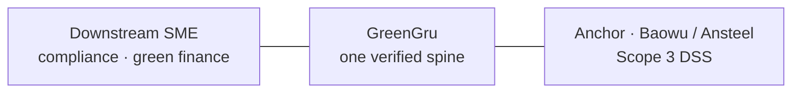
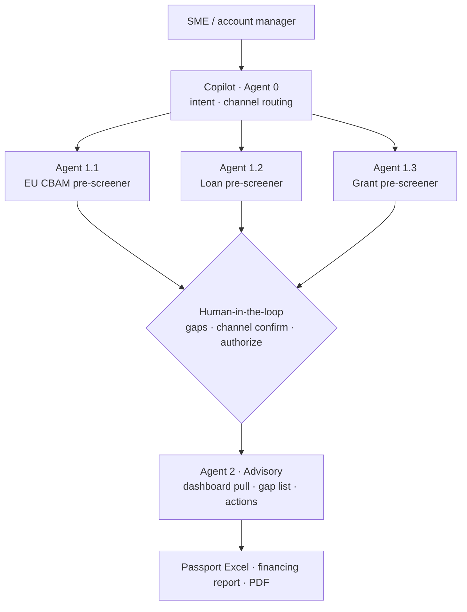
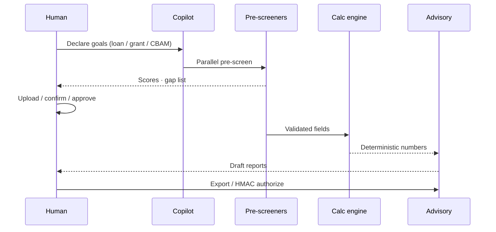
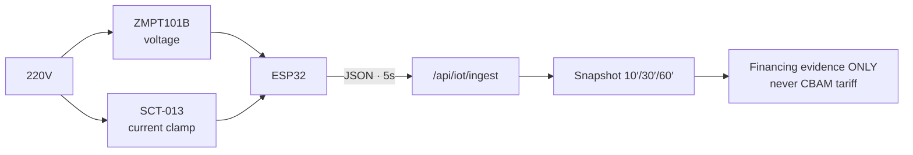
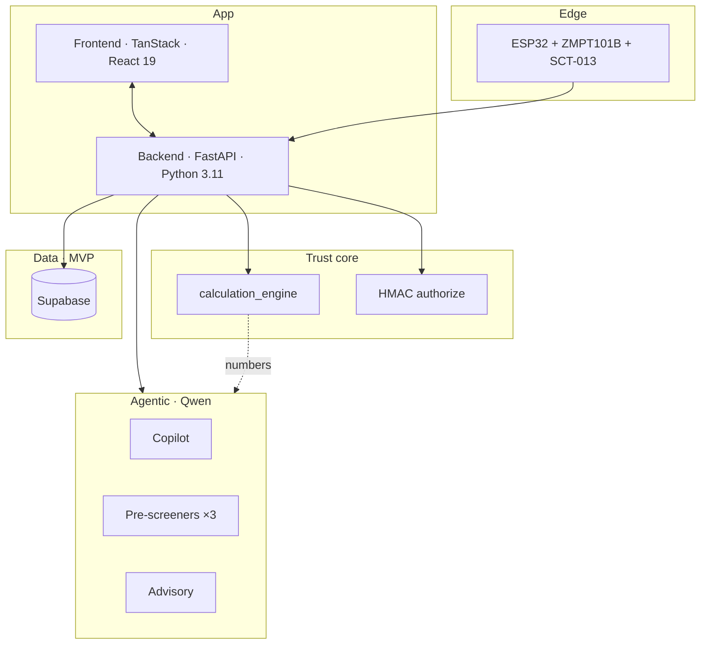
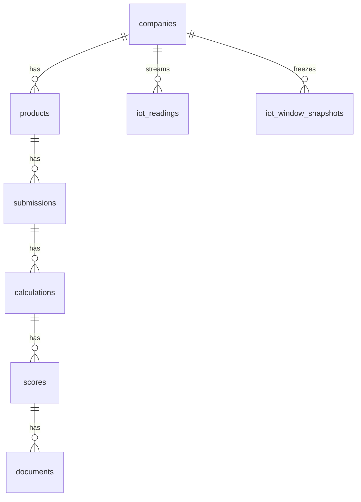

<p align="center">
  
  
  
  
</p>

<h1 align="center">GreenGru</h1>
<p align="center"><i>Turn carbon compliance into bankable capacity.</i></p>

<p align="center">
  <a href="./README.md"><b>🇨🇳 中文</b></a>
  &nbsp;·&nbsp;
  <a href="#english"><b>🇬🇧 English</b></a>
</p>

---

<a id="english"></a>

## 🇬🇧 English

### One-liner

**GreenGru** = shopfloor meters + deterministic carbon math + an **agentic multi-channel workflow with human-in-the-loop** → unlock green loans, factory grants, and EU CBAM passports — while giving Baowu/Ansteel-class anchors a Scope 3 decision net.

---

### 💡 Idea

Not another carbon calculator.

GreenGru turns steel-downstream SME **invoices · IoT electricity · process routes** into one verified data spine:

- **SMEs:** compliance docs → financing readiness (loan · grant · EU license)
- **Anchors:** Scope 3 Category 10 visibility, tiering, action
- **Trust:** engines compute regulated numbers; agents classify & write; humans approve at gates



| Who | Pain | GreenGru |
|-----|------|----------|
| SME | Can't file CBAM / unlock green credit | Three-channel pre-screen + reports |
| Anchor | Scope 3 in spreadsheets | Supplier map · CISA tiers |
| Bank | No verifiable kWh evidence | ESP32 windows + CISA grid EF |

> **Trust rule:** tCO₂e · CBAM €/t · CISA grade · subsidy amounts → **deterministic engines**. Qwen **only reads numbers** to write/classify — never invents a tariff.

---

### ⚙️ How it works

#### 1. Multimodal intake

- Invoice PDF/JPEG → OCR  
- ESP32 meter → `POST /api/iot/ingest`  
- Natural-language goals → **Copilot (Agent 0)** routes channels  

#### 2. Agentic workflow + human-in-the-loop

Fixed orchestration (not free-roaming agents). Specialist agents run in parallel; humans decide at gates:



| Agent | Role |
|-------|------|
| **Copilot (0)** | Understand intent; dispatch channels |
| **1.1 EU CBAM** | Export pre-screen · doc gaps |
| **1.2 Loan** | Green-loan readiness · evidence list |
| **1.3 Grant** | Zero-carbon factory grant · score gaps |
| **2 Advisory** | Scores + factory data → actionable advice |

#### 3. Six-stage pipeline (code-orchestrated)



1 Intake → 2 Validate → 3 Classify (Qwen · CN codes) → 4 **Engine calculate** → 5 Dashboard snapshot → 6 **HMAC authorize**

#### 4. Edge hardware (highlight)

Non-invasive shopfloor metering — demo-ready clamp on live:



- **ESP32** — edge Vrms / Irms / W / kWh  
- **ZMPT101B** — isolated AC voltage  
- **SCT-013** — clamp CT  
- Grid EF (CISA B.3): `0.5568` or `0.5942` t/MWh → `tCO₂e = ΔkWh/1000 × EF`

#### 5. Stage 6 · HMAC authorization pack

- Shared-secret signature on aggregated results  
- **Anchors verify integrity** (no silent edits)  
- **SMEs keep raw invoices private**  
- Lightweight, auditable, channel-SaaS ready  

---

### 🏗️ Architecture



**Schema (bird’s-eye)**



DDL: `supabase/migrations/0001_init.sql` · `0002_iot_window_snapshots.sql`

---

### 🎯 Key Innovations

- **Agentic ≠ chaos** — fixed pipeline + specialist pre-screeners + human gates  
- **Numbers vs prose** — engines own tariffs; agents own documents  
- **One spine, two buyers** — SME monetization + anchor Scope 3  
- **Meters as evidence** — IoT windows feed green finance only, never CBAM  
- **HMAC that ships** — integrity + trade-secret privacy without heavy crypto theater  
- **MVP → China stack** — OpenRouter / Supabase today; Bailian / PolarDB tomorrow  

| Capability | MVP | Production |
|------------|-----|------------|
| LLM | **OpenRouter · Qwen** | **Alibaba Bailian** · ModelScope (optional Stage-0) |
| DB | **Supabase** | **PolarDB / RDS Postgres** |
| Objects | Supabase Storage | **OSS** |

---

### 🧰 Tech Stack

| Layer | Tech |
|-------|------|
| Frontend | TanStack Start · React 19 · Tailwind · Recharts |
| Backend | FastAPI · calc engine · scorers · OCR · IoT · pipeline |
| Agents | Copilot · CBAM / Loan / Grant pre-screeners · Advisory (Qwen) |
| LLM | OpenRouter (MVP) → Bailian / ModelScope (prod) |
| DB | Supabase (MVP) → PolarDB (prod) |
| Edge | ESP32 · ZMPT101B · SCT-013 · HTTP ingest |
| Trust | HMAC packs · RLS |

---

### 💰 Business model

> Sell **compliance + financing readiness** to SMEs; sell **Scope 3 visibility + supplier tiering** to anchors.  
> One verified spine — two paying sides. Channel SaaS, not a carbon toy.

- SME SaaS / per-passport fees  
- Anchor seats (account-manager DSS)  
- Hardware metering kits  
- Bank / subsidy channel share  

---

### ❓ FAQ (judge defense)

**❓ Will agents invent tariffs?**  
No. Regulated numbers come only from `calculation_engine`. Agents **read results** to write and classify.

**❓ Why human-in-the-loop?**  
Pre-screeners surface scores and gaps; humans confirm uploads, channels, and authorization — finance/compliance must be accountable.

**❓ Why three pre-screeners instead of one mega-model?**  
Loan, grant, and CBAM have different rulebooks and evidence packs. Separation cuts hallucination and keeps RAG/eval clean.

**❓ Does IoT electricity enter CBAM?**  
**No.** Steel is Annex II — CBAM prices direct emissions. Meters serve green-loan / grant evidence only.

**❓ Why HMAC?**  
Goal: **prove integrity without exposing raw invoices**. HMAC is lightweight, auditable, and demo-explainable for channel SaaS.

**❓ Why OpenRouter + Supabase for MVP?**  
Hackathon velocity. Production swaps to **Bailian (Beijing) + PolarDB** via the same OpenAI-compatible client and ORM.

**❓ Why do anchors pay?**  
Scattered SME compliance becomes Scope 3 Cat.10 + CISA tiers — account managers act, instead of chasing Excel.

---

### 🚀 Quick start

```bash
cd backend && python -m venv .venv && pip install -r requirements.txt
# .env → OPENROUTER_* / Supabase (optional)
uvicorn app.main:app --reload --host 0.0.0.0 --port 8000

cd frontend && npm install && npm run dev
```

Firmware: `firmware/src/main.ino` (optional Blynk + GreenGru HTTP)

```text
GreenGru/
├── frontend/     # dashboard · channels · Copilot · upstream DSS
├── backend/      # FastAPI · engine · agent orchestration · IoT
├── firmware/     # ESP32 smart meter
├── supabase/     # Postgres migrations + RLS
└── PRD.md        # spec; HMAC authorize · engine/agent boundary
```

---

### 🔥 Closing

**GreenGru: agentic multi-channel workflow + human-in-the-loop + verifiable shopfloor meters — carbon compliance that becomes bankable capacity on Baowu-class supply chains.**

<p align="center"><a href="./README.md"><b>← 中文版</b></a></p>
