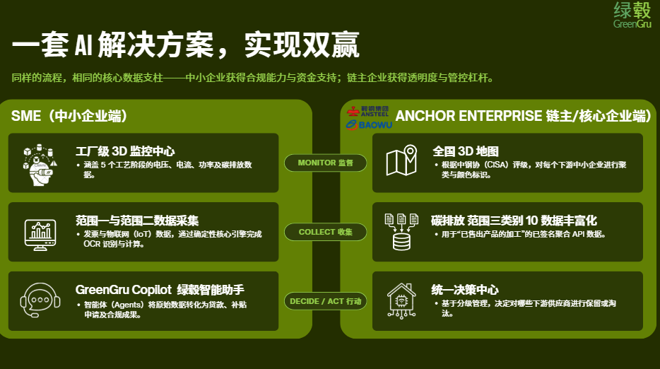
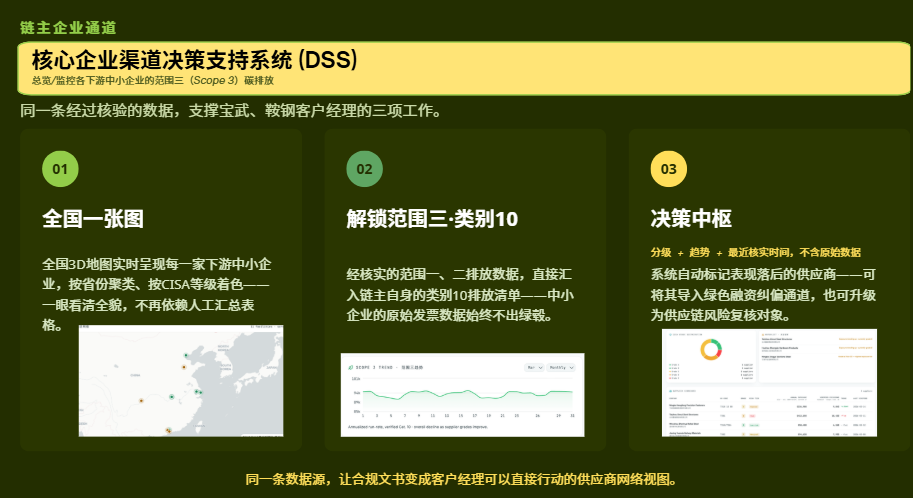
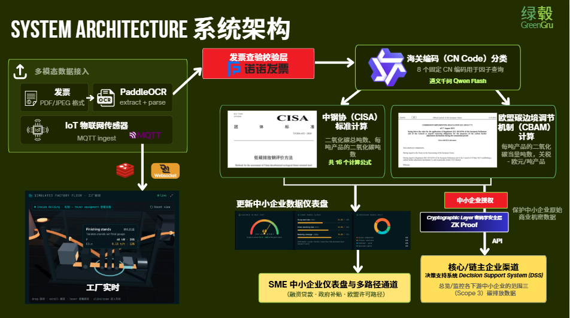
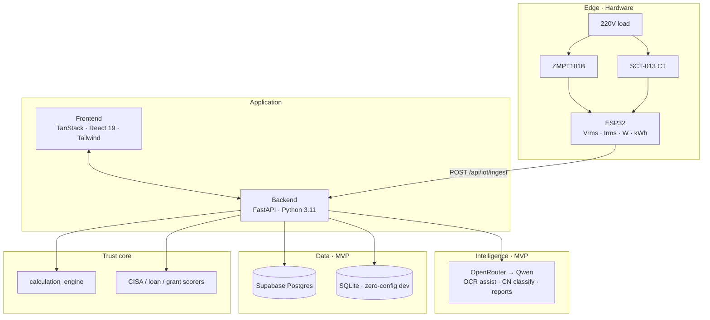
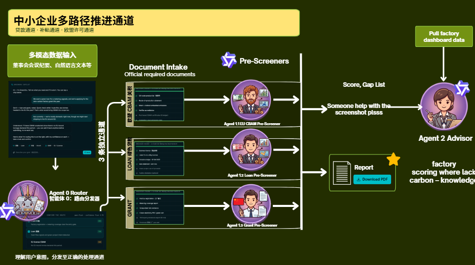
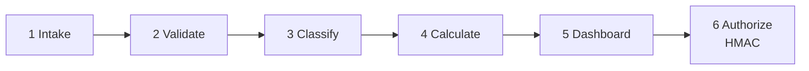
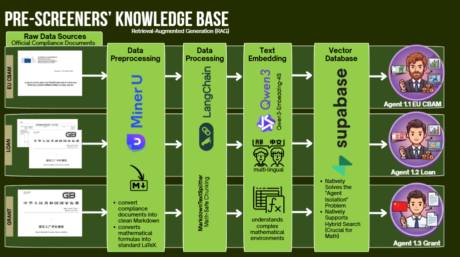
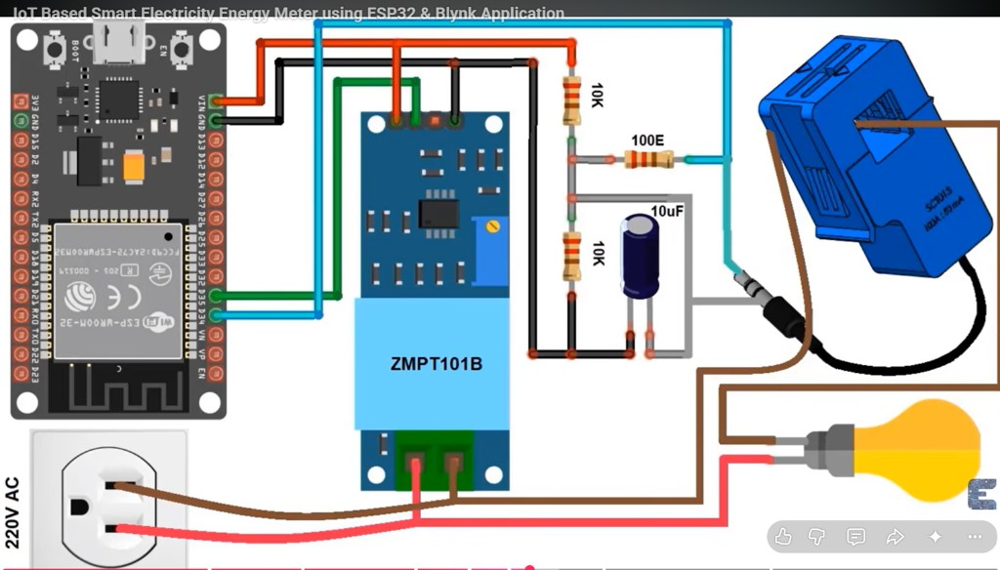
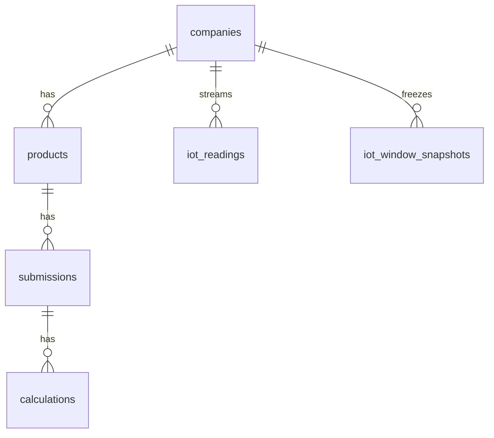

<p align="center">
  
  
  
  
</p>

<h1 align="center">GreenGru</h1>
<p align="center"><b>Carbon passport · green loan · zero-carbon factory grant — for steel-downstream SMEs</b></p>
<p align="center">One verified data spine for <b>SME monetization</b> and <b>Baowu / Ansteel Scope 3 decisioning</b></p>

<p align="center">
  <a href="./README.md"><b>🇨🇳 中文</b></a>
  &nbsp;·&nbsp;
  <a href="#greengru"><b>🇬🇧 English</b></a>
</p>

---

## Why now?

From 2026, EU **CBAM** bills for real. Exporters without verified actuals fall onto **default-value paths** — industry walkthroughs put slab near **~€172/t** and downstream fasteners near **~€526/t**, enough to wipe thin SME margins.

Domestically, **green loans, CERF-style facilities, and zero-carbon factory subsidies** are expanding — but SMEs lack meters, evidence packs, and bilingual filings. Anchor enterprises need auditable **Scope 3 Category 10** across thousands of suppliers.

**GreenGru** ships a demo-ready channel: **shopfloor meter + invoice OCR + deterministic engines + Qwen prose**.

| Who | Pain | GreenGru |
|-----|------|----------|
| **Downstream SME** | Can't file CBAM, can't unlock green credit | Three routes: EU license · loan · grant |
| **Baowu / Ansteel** | Scope 3 lives in spreadsheets | Portfolio map · CISA tiers · action hub |
| **Banks / reviewers** | No verifiable electricity evidence | ESP32 time windows + CISA grid EF |

> **Trust rule:** Regulated numbers (tCO₂e, CBAM €/t, CISA grade, subsidy amounts) come from **deterministic code**. Qwen **only reads those numbers** to classify and write — never invents a tariff.

---

## Product at a glance

<p align="center">
  
</p>

- **Three channels:** green loan · factory grant · EU CBAM passport  
- **Edge hardware:** ESP32 + ZMPT101B + SCT-013 → HTTP ingest (Blynk optional)  
- **Save windows:** last **10 / 30 / 60 minutes** on New submission → attached to pipeline as **financing evidence only** (never CBAM tariff math)

<p align="center">
  
</p>

---

## Architecture

<p align="center">
  
</p>



> **Stage 6 trust: HMAC authorization packs.** A shared-secret signature proves the aggregated payload wasn’t tampered with — anchors can verify integrity without SMEs handing over raw invoices. Lightweight, auditable, and practical for channel SaaS.

### MVP → China production

| Capability | MVP (fast) | Production (sovereignty) |
|------------|------------|---------------------------|
| LLM | **OpenRouter · Qwen** | **Alibaba Bailian / DashScope** (Beijing) · ModelScope optional Stage-0 |
| DB | **Supabase** | **PolarDB / RDS Postgres** (same ORM) |
| Objects | Supabase Storage | **OSS** |
| IoT | ESP32 → HTTP | Same; optional MQTT bridge |

---

## Six-stage pipeline (fixed orchestration)

<p align="center">
  
</p>



Pre-screener knowledge base (RAG): compliance docs → MinerU → LangChain chunking → Qwen embeddings → Supabase → channel agents.

<p align="center">
  
</p>

IoT snapshots travel in Stage 1 / Stage 6 as:

`scope = financing_electricity_only_not_cbam`

---

## Hardware (highlight)

<p align="center">
  
</p>

| Part | Role |
|------|------|
| **ESP32** | Edge Wi‑Fi, local RMS / power / kWh |
| **ZMPT101B** | Isolated AC voltage |
| **SCT-013** | Clamp CT + bias circuit |
| **Path** | Optional Blynk + **HTTP → GreenGru** |

Grid EF (CISA App. B.3): **0.5568** vs **0.5942** t/MWh by green-power trading choice →  
`tCO₂e = ΔkWh / 1000 × EF`

---

## Stack map

- **Frontend** — TanStack Start, React 19, Tailwind, Recharts, bilingual SME + upstream DSS  
- **Backend** — FastAPI, CBAM engine, scorers, OCR, IoT, pipeline, Excel/PDF  
- **DB** — `supabase/migrations/0001_init.sql`, `0002_iot_window_snapshots.sql`



---

## Business model (one line)

> Sell **compliance + financing readiness** to SMEs; sell **Scope 3 visibility + supplier tiering** to anchors — **one verified spine, two paying sides**.

---

## Quick start

```bash
cd backend && python -m venv .venv && pip install -r requirements.txt
# configure OpenRouter + Supabase in .env
uvicorn app.main:app --reload --host 0.0.0.0 --port 8000

cd frontend && npm install && npm run dev
```

Firmware: `firmware/src/main.ino`

---

## Credo

1. **Numbers are trusted** — engines compute; models write.  
2. **Channels distribute** — via Baowu / Ansteel into SME networks.  
3. **Edge is evidence** — meters unlock green finance.  
4. **Sovereignty upgrades** — MVP global stack → China cloud at launch.

<p align="center"><b>GreenGru — turn carbon compliance into bankable capacity.</b></p>

<p align="center"><a href="./README.md">← 中文版 README</a></p>
