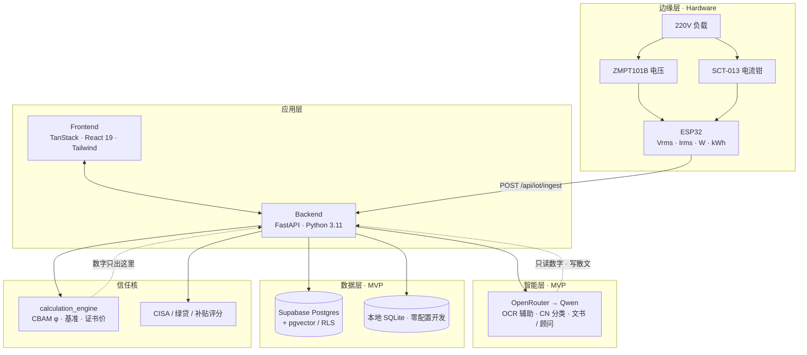
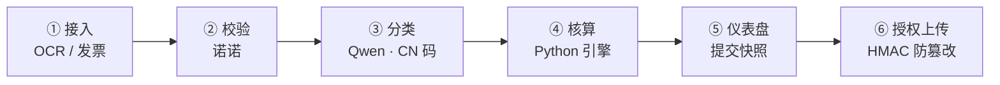
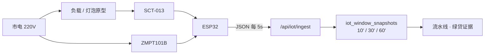
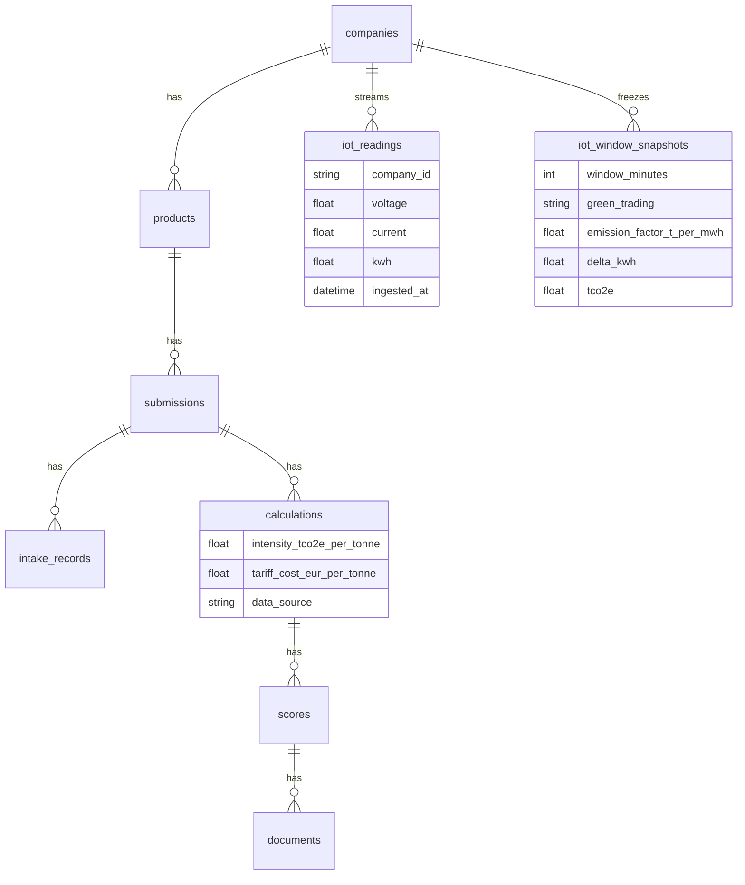

<p align="center">
  
  
  
  
</p>

<h1 align="center">GreenGru · 绿毂</h1>
<p align="center"><b>钢铁下游中小企业的碳护照 · 绿贷 · 零碳工厂补贴通道</b></p>
<p align="center">一套数据源，同时服务 <b>中小企业合规变现</b> 与 <b>宝武 / 鞍钢等链主 Scope 3 决策</b></p>

<p align="center">
  <a href="#-中文"><b>🇨🇳 中文</b></a>
  &nbsp;·&nbsp;
  <a href="./README.en.md"><b>🇬🇧 English</b></a>
</p>

---

<a id="-中文"></a>

## 🇨🇳 中文

### 为什么是现在？

2026 年起，欧盟 **CBAM** 进入实质计费：不会报实际排放的出口商，只能吃高额 **默认值路径**——文献与行业测算中，板坯默认路径约 **€172/t**、下游紧固件可达 **€526/t** 量级，足以吞噬中小企业薄利。

与此同时，国内 **绿贷 / 碳减排支持工具 / 零碳工厂补贴** 正在扩围，但 SME 缺计量、缺证据、缺双语文书；链主企业则急需把下游 **Scope 3 · 类别 10** 做成可审计的一张网。

**绿毂** 把「车间电表 + 发票 OCR + 确定性核算引擎 + Qwen 文书」打成一条可演示、可落地的产品通道。

| 谁痛 | 痛点 | 绿毂给什么 |
|------|------|------------|
| **下游 SME** | 不会做 CBAM、贷不到绿贷、补贴材料散 | 三通道一键跑通：欧盟许可 / 绿贷 / 补贴 |
| **宝武 · 鞍钢等链主** | Scope 3 靠表格、看不见供应商碳等级 | 上游组合视图 · CISA 分档 · 可行动预警 |
| **银行 / 评审方** | 缺可核验用电与排放证据 | ESP32 时间窗快照 + CISA 电网因子 |

> **信任铁律：** 所有管制数字（tCO₂e、CBAM €/t、CISA 档、补贴额）由 **确定性代码** 计算；Qwen **只读已算数字、写文书与分类**——从不反过来“编”一个关税。

---

### 产品一览

<p align="center">
  
</p>

```text
SME 工厂端                          链主 / 核心企业端
─────────────                      ─────────────────
发票 + ESP32 电表                   全国供应商一张图
    ↓                                   ↓
六阶段流水线（绿贷/补贴/CBAM）      Scope 3 Cat.10 趋势
    ↓                                   ↓
护照 Excel · 融资报告 · 建议书      决策中枢 · 分级处置
```

- **三条通道：** 绿色贷款 · 零碳工厂补贴 · 欧盟 CBAM 许可  
- **边缘硬件：** ESP32 + ZMPT101B + SCT-013，HTTP 直达后端（可并行 Blynk）  
- **实时与存档：** 新建提交页保存 **最近 10 / 30 / 60 分钟** 用电窗，随流水线提交（仅融资证据，**不进 CBAM 关税**）

<p align="center">
  
</p>

---

### 总架构

<p align="center">
  
</p>



> 产品信任层使用 **HMAC 授权包**（非 ZK / 非链上）。示意图侧重业务价值；实现以本仓库代码与 PRD 为准。

**MVP → 生产（中国栈）平滑升级**

| 能力 | MVP（易启动） | 生产（数据主权 / 水木叙事） |
|------|----------------|------------------------------|
| LLM | **OpenRouter · Qwen** | **阿里云百炼 DashScope**（北京）· ModelScope 作 Stage-0 可选 |
| Embedding | OpenRouter / Qwen embedding | 百炼 `text-embedding-v4` 或 ModelScope `Qwen3-Embedding-*` |
| 数据库 | **Supabase** | **阿里云 PolarDB / RDS Postgres**（同 SQLAlchemy 模型） |
| 对象存储 | Supabase Storage（可选） | 阿里云 OSS（护照 Excel / 发票） |
| IoT | ESP32 → HTTP → FastAPI | 同左；可加 MQTT 桥 |

---

### 六阶段流水线（固定编排，非自治 Agent）

<p align="center">
  
</p>



并行还有 **贷款 / 补贴 / CBAM** 三条路由评分与文书；Copilot（Agent 0）做意图分流。

预筛知识库（RAG）路径：官方合规文档 → MinerU → LangChain 分块 → Qwen Embedding → Supabase 向量库 → 通道专家代理。

<p align="center">
  
</p>

IoT 时间窗快照挂在 Stage 1 / Stage 6 包体中，标注：

`scope = financing_electricity_only_not_cbam`

---

### 硬件亮点（Hackathon 杀手锏）

非侵入式车间计量，**可夹在进线火线上演示**：

<p align="center">
  
</p>

| 部件 | 作用 |
|------|------|
| **ESP32** | Wi‑Fi 边缘计算，本地算 Vrms / Irms / Power / kWh |
| **ZMPT101B** | 交流电压隔离采样 |
| **SCT-013** | 钳式电流互感器 + 偏置调理电路 |
| **路径** | Blynk 仪表（可选）+ **HTTP → GreenGru**（产品路径） |



电网排放：企业选择是否参与 **市场化绿电交易** → CISA 附录 B.3  
`0.5568` 或 `0.5942` t/MWh → `tCO₂e = ΔkWh / 1000 × EF`

---

### 前端 · 后端 · 库表（鸟瞰）

**Frontend** `frontend/`  
TanStack Start · React 19 · Tailwind · Recharts · 双语 UI  
SME 总览 / 新建提交 / 三通道 Copilot / 链主上游组合（地图 · Scope 3 趋势）

**Backend** `backend/`  
FastAPI · 确定性 `calculation_engine` · 评分器 · OCR · IoT · 流水线编排 · WeasyPrint / CBAM Excel

**Database**（示意）



完整 DDL：`supabase/migrations/0001_init.sql` · `0002_iot_window_snapshots.sql`

---

### 商业模式一句话

> **向下游卖合规与融资就绪，向链主卖 Scope 3 可见性与供应商分级。**  
> 同一条核验数据，两边都愿意付费——这是渠道型 SaaS，不是又一个碳计算器。

| 收入想象 | 说明 |
|----------|------|
| SME SaaS / 按次护照 | 出口季刚需 |
| 锚点企业席位 | 宝武式客户经理 DSS |
| 硬件 + 安装 | ESP32 计量包 |
| 银行 / 补贴渠道分成 | 绿贷获客与材料标准化 |

---

### 快速启动

```bash
# Backend
cd backend && python -m venv .venv
# Windows: .venv\Scripts\activate
pip install -r requirements.txt
copy .env.example .env   # 配置 OPENROUTER / Supabase 等
uvicorn app.main:app --reload --host 0.0.0.0 --port 8000

# Frontend
cd frontend && npm install && npm run dev
```

零密钥时可跑 **mock LLM**；接真实 Qwen：在 `.env` 配置 **OpenRouter**（MVP）。生产切 **百炼** 只需换 base URL / key。

固件：`firmware/src/main.ino`（Blynk + GreenGru HTTP）。

---

### 仓库结构

```text
GreenGru/
├── frontend/          # TanStack · 仪表盘 · 三通道 · 上游
├── backend/           # FastAPI · 引擎 · 流水线 · IoT
├── firmware/          # ESP32 智能电表
├── supabase/          # Postgres 迁移 + RLS
└── PRD.md             # 产品与否决项（ZK / 区块链等已明确不做）
```

---

### 团队信条

1. **数字可信** — 引擎算，模型写。  
2. **通道可分发** — 通过宝武 / 鞍钢触达千家 SME。  
3. **边缘可核验** — 电表不是装饰，是绿贷证据。  
4. **主权可升级** — MVP 用全球易用栈，上线可迁中国云。

<p align="center"><b>绿毂 · 让碳合规变成可融资的产能。</b></p>

---

<a id="english"></a>

> For the full English version, open **[README.en.md](./README.en.md)**.
