<p align="center">
  
  
  
  
</p>

<h1 align="center">GreenGru · 绿毂</h1>
<p align="center"><i>把碳合规，变成可融资的产能。</i></p>

<p align="center">
  <a href="#-中文"><b>🇨🇳 中文</b></a>
  &nbsp;·&nbsp;
  <a href="./README.en.md"><b>🇬🇧 English</b></a>
</p>

---

<a id="-中文"></a>

## 🇨🇳 中文

### One-liner

**绿毂** = 车间电表 + 确定性核算 + **Agentic 多通道工作流（人机协同）** → 一次跑通绿贷 / 补贴 / 欧盟 CBAM，并给宝武·鞍钢级链主一张 Scope 3 决策网。

---

### 🔥 Problem · 现状痛点

2026 年起，欧盟 **CBAM** 进入实质计费。不会报**实际排放**的出口商，只能吃高额 **默认值路径**——行业测算中板坯默认路径约 **€172/t**、下游紧固件可达 **€526/t**，足以吞噬中小企业薄利。

国内 **绿贷 / 碳减排支持工具 / 零碳工厂补贴** 正在扩围，但 SME **缺计量、缺证据、缺双语文书**；宝武·鞍钢等链主则急需把下游 **Scope 3 · 类别 10** 做成可审计的一张网——今天仍靠 Excel 与口头催报。

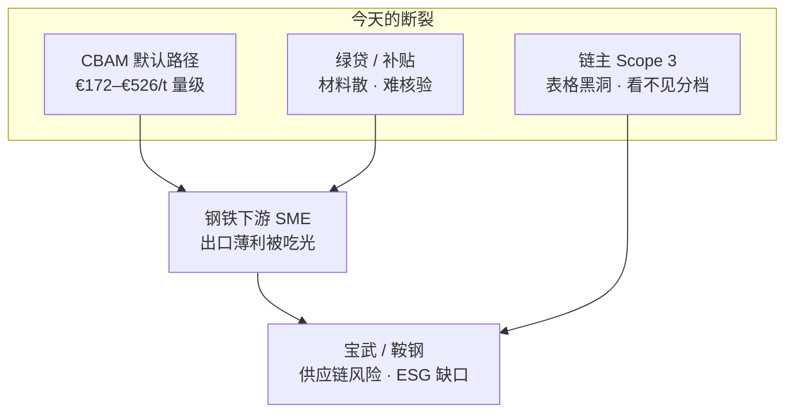

| 谁 | 现在怎么痛 | 绿毂给什么 |
|----|------------|------------|
| **下游 SME** | 不会做 CBAM、贷不到绿贷、补贴材料散 | 三通道预筛 + 护照 / 融资报告 |
| **宝武 · 鞍钢** | Scope 3 靠表格、看不见供应商碳等级 | HMAC 验真 API · CISA 分档 · 决策中枢 |
| **银行 / 评审** | 缺可核验用电与排放证据 | ESP32 时间窗 + CISA 电网因子 |

---

### 📈 链主为何要收 Scope 3（尤其 Cat.10）

对宝武 / 鞍钢级上市公司，**Scope 3 不是报表装饰——是市值、监管与客户关系的硬指标。**  
中国多数钢企仍停在 Scope 1+2；能算清 Scope 3 的（如宝钢路径）= 更高治理与透明度。绿毂把下游 SME 核验数据聚成 **Cat.10（售出产品的加工）** 可入库视图。

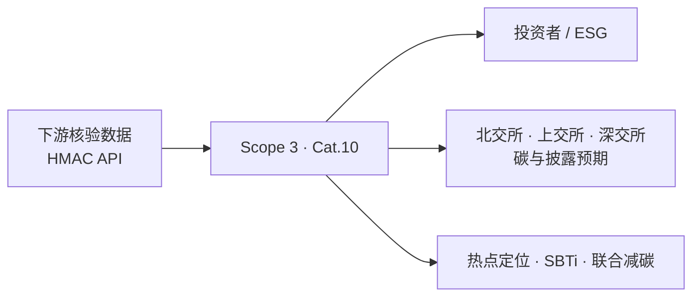

**1. 战略与资本市场**

- **对标投资者与监管** — 全球 ESG 与交易所披露趋严；宝武级碳足迹中 Scope 3 权重极高，披露与减排是投资者信任信号，对齐全国碳市场叙事  
- **沪深京三所预期** — **上海 / 深圳 / 北京** 交易所对碳与气候信息披露要求持续抬升；有 Cat.10 实数，才站得住脚  
- **品牌与公信力** — 矿业 / 钢铁巨头 Cat.10 动辄数亿吨 CO₂e（如 Rio Tinto ~3.96 亿 t、BHP >3 亿 t 量级）；有数据才能证明「管住了最大气候影响」

**2. 风险地图 → 减碳路径**

- **点亮热点** — 没有下游加工数据 = 对最大气候风险「盲飞」；Cat.10 常集中在客户炼铁 / 加工环节（如高炉可占下游约 2/3）  
- **指导产品与研发** — 看清客户 BF-BOF vs EAF，才能推高品矿、低能耗路线、联合技改投资  
- **解锁 SBTi** — 钢企科学碳目标明确覆盖「中间品加工」排放；**没有 Cat.10 数据，就没有可信 Scope 3 目标**

**3. 客户关系升级（商品 → 伙伴）**

- **从行业均值 → 客户实数** — 与重点下游共创工艺与因子，账算得准、减得准  
- **联合治理红利最高** — 供应链协同减碳净收益往往高于单打独斗；链主从「卖钢」变成「低碳转型伙伴」  
- **锁长约与绿品溢价** — 数据协作 → 共投技术 → 绿色产品长期供货协议  

> **绿毂一句话：** SME 跑完合规，链主一键收 **可验签 Scope 3**——满足三所与投资者，同时把客户关系做成减碳同盟。

---

### 🏢 链主视角 · 渠道决策支持（DSS）

面向宝武 / 鞍钢**客户经理**：同一条核验数据源，把合规文书变成可直接行动的**供应商网络视图**。

<p align="center">
  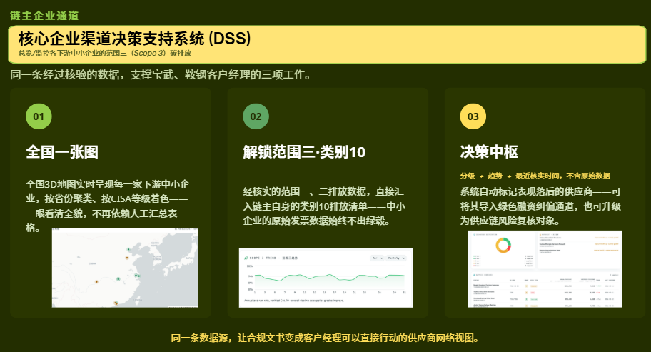
</p>

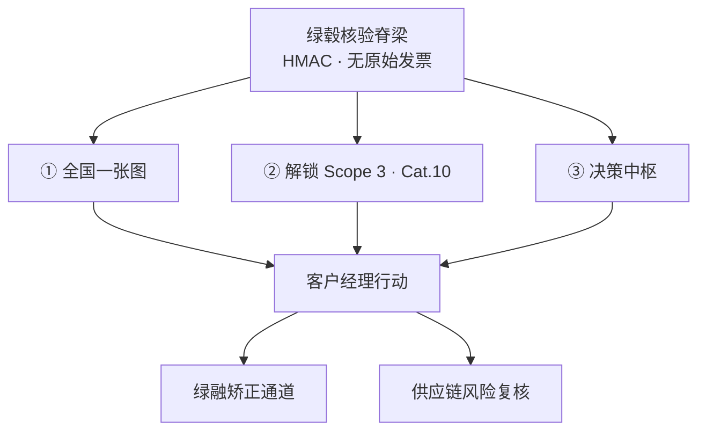

| 模块 | 做什么 | 价值 |
|------|--------|------|
| **① 全国一张图** | 下游 SME 实时落图 · 按省聚类 · **CISA 色档** | 告别手工汇总表 |
| **② 解锁 Scope 3 · Cat.10** | SME 已核验 Scope 1+2 → 自动入链主 Cat.10 库存 | **原始发票永不离开绿毂** |
| **③ 决策中枢** | 只看分档 · 趋势 · 最近核验时间（无敏感底稿） | 自动标出落后供应商 |

- **一张图管全国** — 省份 × CISA 等级，客户经理秒级掌握网络健康度  
- **Cat.10 可入库** — 供应商档位改善 → 年化已核验 Cat.10 趋势下降（可叙事、可披露）  
- **行动闭环** — 落后户进「绿融矫正」或「供应链风险复核」，合规变经营动作  

---

### 💡 Idea

不是又一个碳计算器。

绿毂把钢铁下游 SME 的 **发票 · IoT 用电 · 工艺路由** 打成同一条可核验数据脊梁：

- **对 SME：** 合规文书变融资就绪（贷款 · 补贴 · 欧盟许可）
- **对链主：** Scope 3 · 类别 10 可见、可分级、可行动
- **对信任：** 管制数字由代码算；Agent 只分类与写文书；关键闸口 **Human-in-the-loop**

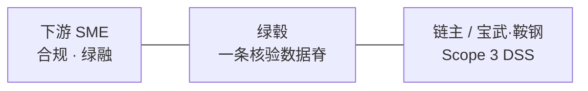

> **信任铁律：** tCO₂e · CBAM €/t · CISA 档 · 补贴额 → **确定性引擎**。Qwen **只读数字**，写散文 / 分类。从不“编”关税。

---

### ⚙️ How it works

#### 1. 多模态接入

- 发票 PDF/JPEG → OCR
- ESP32 电表 → `POST /api/iot/ingest`
- 自然语言目标 → **Copilot（Agent 0）** 分流

#### 2. Agentic 工作流 + Human-in-the-loop

固定编排（非自治乱飞），专家 Agent 并行，人在关键节点拍板：

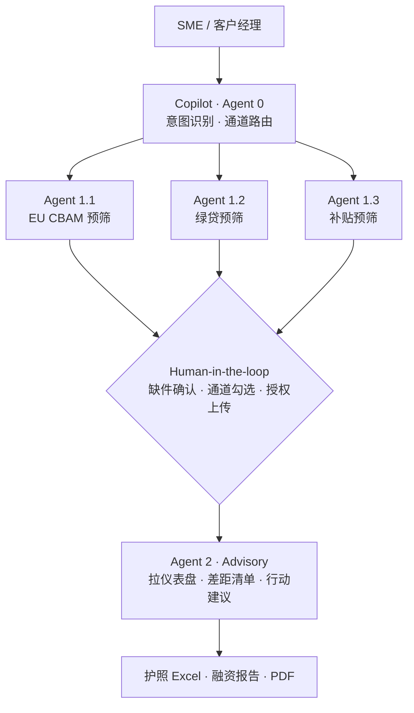

| Agent | 角色 |
|-------|------|
| **Copilot (0)** | 理解目标，分发到正确通道 |
| **1.1 EU CBAM** | 出口合规预筛 · 材料缺口 |
| **1.2 Loan** | 绿贷就绪度 · 证据清单 |
| **1.3 Grant** | 零碳工厂补贴 · 评分缺口 |
| **2 Advisory** | 汇总分数 + 工厂数据 → 可执行建议 |

#### RAG · 预筛知识库

三通道预筛不靠「裸模型硬背法规」，而是 **RAG**：官方合规文档 → 清洗分块 → 向量入库 → 按通道检索，喂给对应 Agent。专治 **中英双语 + 公式/表格** 类监管文本。

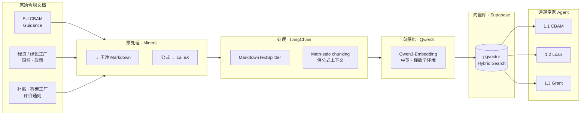

| 步骤 | 技术 | 解决什么 |
|------|------|----------|
| 抽取 | **MinerU** | PDF/扫描件 → Markdown；公式标准化为 LaTeX |
| 分块 | **LangChain** MarkdownTextSplitter | 按结构切；**Math-safe** 不打断公式块 |
| 嵌入 | **Qwen3-Embedding**（MVP 经 OpenRouter） | 中英双语 + 复杂数学/表格语义 |
| 存储检索 | **Supabase pgvector** | **Hybrid Search**（关键词+向量，公式友好）；通道隔离，避免 Agent 串库 |
| 消费 | 预筛 Agent 1.1 / 1.2 / 1.3 | 只检索本通道语料 → 分数与缺口清单 |

生产可迁：**百炼 Embedding / ModelScope `Qwen3-Embedding-*`** + **PolarDB**，管线形状不变。

#### 3. 六阶段流水线（代码编排）

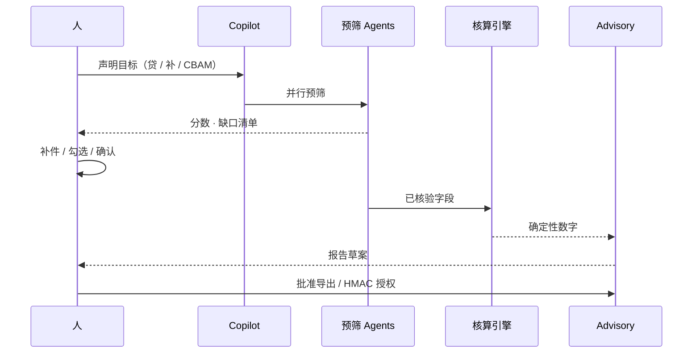

1. 接入 → 2. 校验 → 3. 分类（Qwen · CN 码）→ 4. **引擎核算** → 5. 仪表盘快照 → 6. **HMAC 授权上传**

#### 4. 边缘硬件（杀手锏）

非侵入式车间计量，可演示夹火线：

<p align="center">
  
</p>

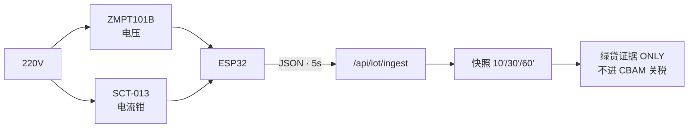

- **ESP32** — 边缘算 Vrms / Irms / W / kWh  
- **ZMPT101B** — 交流电压隔离采样  
- **SCT-013** — 钳式电流互感器（含 10kΩ 偏置 + 100Ω burden + 10µF）  
- 电网 EF（CISA B.3）：`0.5568` 或 `0.5942` t/MWh → `tCO₂e = ΔkWh/1000 × EF`

#### 5. Stage 6 · HMAC 授权包 → 链主 API

SME 授权后，汇总包经 **SHA-256 + HMAC-SHA256** 签名推给宝武 / 鞍钢。链主只读**聚合结果**（强度、档位、Scope 1+2、护照摘要），**原始发票永不经此 API 露出**。

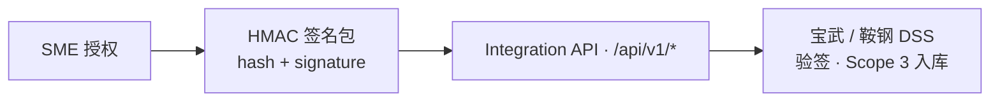

**宝武 / 鞍钢可调用的关键接口（节选）**

| Method | Endpoint | 作用 | HMAC |
|--------|----------|------|------|
| `GET` | `/api/v1/portfolio/summary` | 下游组合 Scope 3 Cat.10 汇总 | 响应体可验签 |
| `GET` | `/api/v1/suppliers` | 供应商列表 · CISA / 核验状态 | 同上 |
| `GET` | `/api/v1/suppliers/{id}/emissions` | Scope 1+2 聚合 tCO₂e（只读） | 同上 |
| `GET` | `/api/v1/suppliers/{id}/passport` | CBAM 护照摘要 · 关税敞口 | 同上 |
| `GET` | `/api/v1/scope3/trend` | Scope 3 趋势（决策中枢曲线） | 同上 |
| `GET` | `/api/baowu/dashboard` | 客户经理仪表盘行 | 同上 |
| `POST` | `/api/v1/webhooks` | 护照核验 / 档位变更事件回调 | 回调带 HMAC |

> 鉴权：`api_key` + 载荷 **HMAC**。防篡改、可追责；SME 商业秘密留在绿毂侧。

---

### 🏗️ Architecture

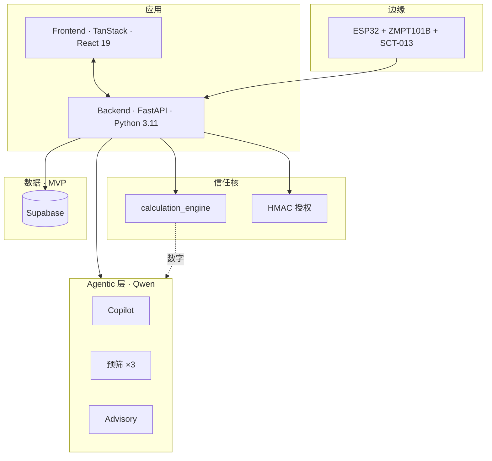

**Schema（鸟瞰）**

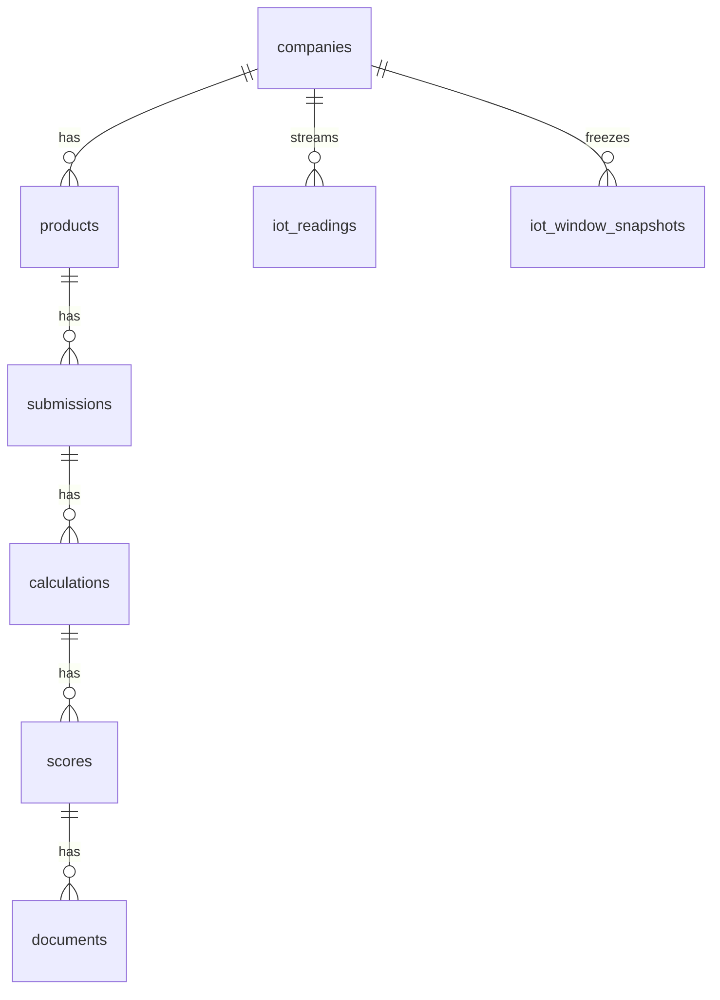

DDL：`supabase/migrations/0001_init.sql` · `0002_iot_window_snapshots.sql`

---

### 🎯 Key Innovations

- **Agentic ≠ 失控** — 固定流水线 + 专家预筛 + 人拍板  
- **数字与散文分离** — 引擎算关税；Agent 写护照与建议  
- **双端同一脊梁** — SME 变现 + 链主 Scope 3  
- **电表即证据** — IoT 时间窗只服务绿融，不污染 CBAM  
- **HMAC 可落地** — 防篡改 + 保护商业秘密，无需重链  
- **RAG 通道隔离** — MinerU → LangChain → Qwen Embedding → Supabase；三预筛各取各的法规库  
- **MVP → 中国栈** — OpenRouter / Supabase 今天跑；百炼 / PolarDB 明天切

| 能力 | MVP | 生产 |
|------|-----|------|
| LLM | **OpenRouter · Qwen** | **阿里云百炼** · ModelScope（Stage-0 可选） |
| DB | **Supabase** | **PolarDB / RDS Postgres** |
| 对象 | Supabase Storage | **OSS** |

---

### 🧰 Tech Stack

| 层 | 技术 |
|----|------|
| Frontend | TanStack Start · React 19 · Tailwind · Recharts |
| Backend | FastAPI · 确定性引擎 · 评分器 · OCR · IoT · 流水线 |
| Agents | Copilot · CBAM / Loan / Grant 预筛 · Advisory（Qwen） |
| RAG | MinerU · LangChain · Qwen3-Embedding · Supabase pgvector / Hybrid Search |
| LLM | OpenRouter（MVP）→ 百炼 / ModelScope（生产） |
| DB | Supabase（MVP）→ PolarDB（生产） |
| Edge | ESP32 · ZMPT101B · SCT-013 · HTTP ingest |
| Trust | HMAC 授权包 · RLS |

---

### 💰 商业模式

> **向下游卖合规与融资就绪；向链主卖 Scope 3 可见性与供应商分级。**  
> 一条核验数据，两边付费 — 渠道型 SaaS，不是碳玩具。

- SME SaaS / 按次护照  
- 锚点企业席位（客户经理 DSS）  
- 硬件计量包  
- 银行 / 补贴渠道分成  

---

### ❓ FAQ（评委防线）

**❓ Agent 会不会乱算关税？**  
不会。管制数字只出 `calculation_engine`。Agent **只读已算结果**，写文书与分类。

**❓ 为什么要 Human-in-the-loop？**  
预筛给分数与缺口；补件、通道确认、授权上传由人完成——合规与融资场景必须可追责。

**❓ 为什么要三个预筛 Agent，而不是一个大模型？**  
贷款 / 补贴 / CBAM 规则库与材料清单不同。分通道降低幻觉与串台，便于 RAG 与评测。

**❓ IoT 电表进不进 CBAM？**  
**不进。** 钢铁属 Annex II：CBAM 只吃直接排放。电表只服务绿贷 / 补贴用电证据。

**❓ 为什么用 HMAC，而不是更重的密码学叙事？**  
目标是：**验真 + 不暴露原始发票**。HMAC 轻量、可审计、评委当场能讲清，适合渠道 SaaS 落地。

**❓ 为什么 MVP 用 OpenRouter + Supabase？**  
黑客松要快。生产切 **百炼（北京）+ PolarDB**，同一 OpenAI 兼容接口与 SQLAlchemy 模型，数据主权可升级。

**❓ 链主为什么买单？**  
把散落 SME 合规结果聚成 Scope 3 · Cat.10 与 CISA 分档——客户经理能直接行动，而不是再要 Excel。

---

### 🚀 快速启动

```bash
# Backend
cd backend && python -m venv .venv
pip install -r requirements.txt
# .env → OPENROUTER_* / Supabase（可选）
uvicorn app.main:app --reload --host 0.0.0.0 --port 8000

# Frontend
cd frontend && npm install && npm run dev
```

固件：`firmware/src/main.ino`（Blynk 可选 + GreenGru HTTP）

```text
GreenGru/
├── frontend/     # 仪表盘 · 三通道 · Copilot · 上游 DSS
├── backend/      # FastAPI · 引擎 · Agents 编排 · IoT
├── firmware/     # ESP32 智能电表
├── supabase/     # Postgres 迁移 + RLS
└── PRD.md        # 规格；HMAC 授权 · 引擎/Agent 边界
```

---

### 🔥 Closing

**绿毂：Agentic 多通道 + 人机协同 + 车间可核验电表 — 让碳合规变成宝武供应链上可融资的产能。**

<p align="center"><a href="./README.en.md"><b>🇬🇧 English version →</b></a></p>
